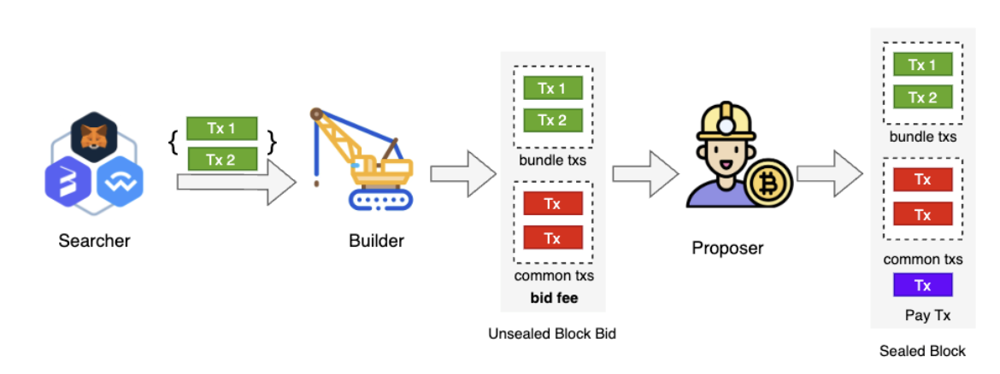

## Overview

The BSC network has introduced the [Builder API Specification](https://github.com/bnb-chain/BEPs/blob/master/BEPs/BEP322.md) to establish a fair and unified MEV market. Previously, BSC clients lacked native support for validators to integrate with multiple MEV providers at once. The network became unstable because of the many different versions of the client software being used. The latest BSC client adopts the [Proposer-Builder Separation](https://ethereum.org/en/roadmap/pbs/) model. Within this unified framework, several aspects of the BSC network have been improved:

- Stability: Validators only need to use the official client to seamlessly integrate with various Builders.
- Economy: Builders that can enter without permission promote healthy market competition. Validators can extract more value by integrating with more builders, which benefits delegators as well.
- Transparency: This specification aims to bring transparency to the BSC MEV market, exposing profit distribution among stakeholders to the public.

This project represents a minimal implementation of the protocol and is provided as is. We make no guarantees regarding its functionality or security.

## What is MEV and PBS

MEV, also known as Maximum (or Miner) Extractable Value, can be described as the measure of total value that may be extracted from transaction ordering. Common examples include arbitraging swaps on decentralized exchanges or identifying opportunities to liquidate DeFi positions. Maximizing MEV requires advanced technical expertise and custom software integrated into regular validators. The returns are likely higher with centralized operators.

Proposer-builder separation(PBS) solves this problem by reconfiguring the economics of MEV. Block builders create blocks and submit them to the block proposer, and the block proposer simply chooses the most profitable one, paying a fee to the block builder. This means even if a small group of specialized block builders dominate MEV extraction, the reward still goes to any validator on the network.

## How it Works on BSC



The figure above illustrates the basic workflow of PBS operating on the BSC network.

- MEV Searchers are independent network participants who detect profitable MEV opportunities and submit their transactions to builders. Transactions from searchers are usually bundled together and included in a block, or none of them will be included.
- The builder collects transactions from various sources to create an unsealed block and offer it to the block proposer. The builder will specify in the request the amount of fees the proposer needs to pay to the builder if this block is adopted. The unsealed block from the builder is also called a block bid as it may request tips.
- The proposer chooses the most profitable block from multiple builders, and pays the fee to the builder by appending a payment transaction at the end of the block.

A new component called "Sentry" has been introduced to enhance network security and account isolation. It assists proposers in communicating with builders and enables payment processing.

## What is More

The PBS model on BSC differs in several aspects from its implementation on Ethereum. This is primarily due to：

1. Different Trust Model. Validators in the BNB Smart Chain are considered more trustworthy, as it requires substantial BNB delegation and must maintain a high reputation. This stands in contrast to Ethereum, where becoming an Ethereum validator is much easier, the barrier to becoming a validator is very low (i.e., 32 ETH).
2. Different Consensus Algorithms. In Ethereum, a block header is transferred from a builder to a validator for signing, allowing the block to be broadcasted to the network without disclosing the transactions to the validator. In contrast, in BSC, creating a valid block header requires executing transactions and system contract calls (such as transferring reward and depositing to the validator set contract), making it impossible for builders to propose the whole block.
3. Different Blocking Time. With a shorter block time of 3 seconds in BSC compared to Ethereum's 12 seconds, designing for time efficiency becomes crucial.

These differences have led to different designs on BSC's PBS regarding payment, interaction, and APIs. For more design philosophy, please refer to [BEP322:Builder API Specification for BNB Smart Chain](https://github.com/bnb-chain/BEPs/blob/master/BEPs/BEP322.md).

## Integration Guide for Builder

The [Builder API Specification](https://github.com/bnb-chain/BEPs/blob/master/BEPs/BEP322.md) defines the standard interface that builders should implement, while the specific implementation is left open to MEV API providers. The BNB Chain community offers a [simple implementation](https://github.com/bnb-chain/bsc-builder) example for reference.

### Customize Builder

Although the builder offers great flexibility, there are still some essential standards that must be followed:

1. The builder needs to set up a builder account, which is used to sign the block bid and receive fees. The builder can ask for a tip (builder fee) on the block that it sends to the sentry. If the block is finally selected, the builder account will receive the tip.
2. The builder needs to implement the mev_reportIssue API to receive the errors report from validators.
3. In order to prevent transaction leakage, the builder can only send block bids to the in-turn validator.
4. At most 3 block bids are allowed to be sent at the same height from the same builder.

Here are some sentry APIs that may interest a builder:

1. `mev_bestBidGasFee`. It will return the current most profitable reward that the validator received among all the blocks received from all builders. The reward is calculated as: `gasFee*(1 - commissionRate) - tipToBuilder`. A builder may compare the `bestBidGasFee` with a local one and then decide to send the block bid or not.
2. `mev_params`. It will return the `BidSimulationLeftOver`,`ValidatorCommission`, `GasCeil` and `BidFeeCeil` settings on the validator. If the current time is after `(except block time - BidSimulationLeftOver)`, then there is no need to send block bids anymore; `ValidatorCommission` and `BidFeeCeil` helps the builder to build its fee charge strategy. The `GasCeil` helps a builder know when to stop adding more transactions.

Builders have the freedom to define various aspects like pricing models for users, creating intuitive APIs, and define the bundle verification rules.

### Setup with Example Builder

Step 1: Find Validator Information
For validators that open MEV integration, the public information is shown at [bsc-mev-info](https://github.com/bnb-chain/bsc-mev-info). Builders can also provide information here to the validator.

Step 2: Set up Builder.
The builder must sign the bid using an account, such as the etherbase account specified in the config.toml file.

```toml
[Eth.Miner.Mev]
BuilderEnabled = true # open bid sending
BuilderAccount = "0x..." # builder address which signs bid, usually it is the same as etherbase address

# Configure the validator node list, including the address of the validator and the public URL. The public URL refers to the sentry service.
[[Eth.Miner.Mev.Validators]]
Address = "0x23707D3D71E31e4Cb5B4A9816DfBDCA6455B52B3"
URL = "https://bsc-fuji.io"

[[Eth.Miner.Mev.Validators]]
Address = "0x..."
URL = "https://bsc-mathwallet.io"
```

## License

The bsc library (i.e. all code outside of the `cmd` directory) is licensed under the
[GNU Lesser General Public License v3.0](https://www.gnu.org/licenses/lgpl-3.0.en.html),
also included in our repository in the `COPYING.LESSER` file.

The bsc binaries (i.e. all code inside of the `cmd` directory) is licensed under the
[GNU General Public License v3.0](https://www.gnu.org/licenses/gpl-3.0.en.html), also
included in our repository in the `COPYING` file.
