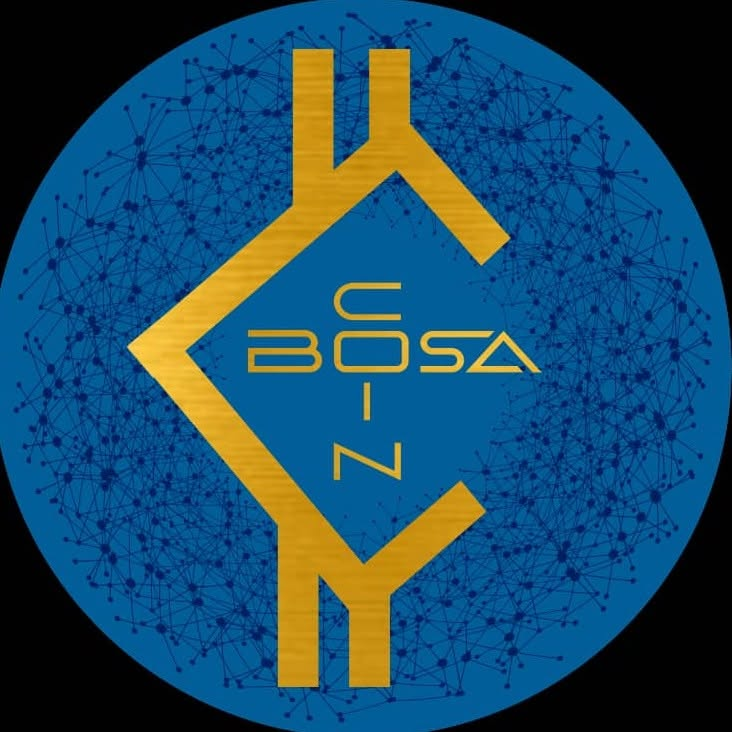

  

  # Coinbosa Chain — Livre blanc

  **Version 3 · juillet 2026**

  Chaîne EVM souveraine · Consensus par preuve d'enjeu · Jeton BOSA

---

## Avertissements

Ce livre blanc n'a été approuvé par aucune autorité compétente, dans aucun pays. L'éditeur du
jeton en est seul responsable.

Ce document n'est pas un prospectus ni une invitation à investir. Il décrit un réseau technique
et son jeton natif. Toute décision les concernant doit se fonder sur la lecture du document
entier.

Le jeton BOSA peut perdre tout ou partie de sa valeur. Il peut se révéler non transférable, et
il peut manquer de liquidité. Il n'est couvert par aucun système de garantie des dépôts ni
d'indemnisation des investisseurs.

Le réseau décrit ici **n'a pas fait l'objet d'un audit de sécurité externe** à la date de
publication. Il ne doit porter aucune valeur réelle tant que cet audit n'a pas eu lieu.

Ce document contient des orientations sur des travaux à venir. Une orientation n'est pas une
promesse. Les descriptions au présent portent sur l'état vérifié du réseau ; les descriptions au
futur portent sur des travaux qui peuvent ne pas aboutir, ou aboutir autrement.

---

## Sommaire

1. [État vérifié du réseau](#1-état-vérifié-du-réseau)
2. [L'éditeur](#2-léditeur)
3. [Le projet et son écosystème](#3-le-projet-et-son-écosystème)
4. [Le jeton BOSA](#4-le-jeton-bosa)
5. [Répartition de l'offre](#5-répartition-de-loffre)
6. [Technologie](#6-technologie)
7. [Le consensus et les validateurs](#7-le-consensus-et-les-validateurs)
8. [Modèle économique](#8-modèle-économique)
9. [Paiements](#9-paiements)
10. [Facteurs de risque](#10-facteurs-de-risque)
11. [Statut juridique](#11-statut-juridique)
12. [Vérifiabilité](#12-vérifiabilité)
13. [Feuille de route](#13-feuille-de-route)

---

## 1. État vérifié du réseau

Cette section ouvre le document parce qu'elle est la plus importante. Elle dit ce qui existe et
ce qui n'existe pas, sans arrondir. Tout le reste doit être lu à sa lumière.

### Ce qui fonctionne, et a été mesuré

| Élément | État |
|---|---|
| Chaîne EVM souveraine, chainId 26262 | en fonctionnement |
| Consensus Parlia, blocs de 5 secondes | mesuré bloc par bloc |
| Franchissement des blocs d'epoch | vérifié aux blocs 200, 400, 600, 800 |
| Contrat système du consensus | écrit sur mesure, en fonctionnement |
| Standard de jeton BRC20 | 26 tests automatisés au vert |
| Offre native de 700 000 000 BOSA | inscrite au genesis, vérifiée on-chain |
| Intégration continue | verte, de bout en bout, sur machine vierge |

### Ce qui n'existe pas encore

- Le réseau est produit par **un seul validateur**. Il n'a donc ni tolérance aux pannes, ni
  sécurité byzantine.
- La **couche d'enjeu** — dépôt, élection par le montant immobilisé, sanctions — n'est pas
  implémentée. Le contrat système expose aujourd'hui un ensemble de validateurs fixe.
- La **finalité rapide** est inactive : les clés de vote sont à zéro. La finalité est
  probabiliste.
- Il n'existe **ni point d'accès public**, ni explorateur indexé, ni passerelle vers un autre
  réseau, ni audit externe.

Aucun de ces manques n'est masqué ailleurs dans le document. Ils sont le programme de travail de
la [feuille de route](#13-feuille-de-route).

---

## 2. L'éditeur

Coinbosa Chain est éditée par **coinbosa, Inc.**, société constituée dans l'État du Delaware,
États-Unis.

L'éditeur est une entité juridique identifiée et responsable. Cette responsabilité est une
propriété de l'éditeur, pas du réseau : elle existerait à l'identique si le jeton était déployé
sur une autre chaîne. Elle est mentionnée ici parce que la réglementation l'exige, non comme un
argument technique.

---

## 3. Le projet et son écosystème

Coinbosa Chain est le socle d'un ensemble de produits financiers et éducatifs. La chaîne n'est
pas une fin en soi : elle existe pour servir ces produits.

| Produit | Nature | État |
|---|---|---|
| **Coinbosa Academy** | école de formation au trading — forex, actions, puis crypto | en production |
| **NextFuture** | place d'échange crypto — marché au comptant et contrats à terme | en construction |
| **Coinbosa Card** | carte prépayée et virtuelle, dépôts en crypto, dépense à l'international | à venir |
| **bite-fast** | place d'échange crypto | externe, existante |
| **Neobanq** | plateforme bancaire | existante |
| **Coinbosa VPN** | service d'abonnement | en cours |

**Aucun de ces produits n'est raccordé à la chaîne à la date de ce document.** Chaque
raccordement — paiement en BOSA, cotation, adossement de la carte — sera annoncé lorsqu'il
fonctionnera, et pas avant. Présenter un raccordement prévu comme acquis serait trompeur.

---

## 4. Le jeton BOSA

BOSA est le **coin natif** de Coinbosa Chain. Il n'existe pas de second actif portant ce nom.

| | |
|---|---|
| Nom | Coinbosa |
| Symbole | BOSA |
| Décimales | 18 |
| Offre totale | 700 000 000 BOSA |
| Émission | aucune — l'offre est fixée au bloc de genèse |

**Les 18 décimales ne sont pas un choix.** L'unité de base d'une machine virtuelle Ethereum est
le wei, et cette valeur est câblée dans le calcul du gas comme dans tous les portefeuilles. Un
coin natif ne peut pas en avoir un autre nombre.

**L'offre est définitive.** Le moteur de consensus ne crée aucune monnaie : le code amont est
explicite sur ce point. Les 700 000 000 BOSA inscrits au genesis sont l'offre totale, pour
toujours. Aucun mécanisme du protocole ne peut l'augmenter.

BOSA a trois fonctions, et seulement trois : il paie les frais de transaction du réseau, il
servira d'enjeu au consensus lorsque la couche d'enjeu sera en place, et il portera la
gouvernance du réseau. Toute autre utilité dépend de raccordements qui ne sont pas réalisés.

### Détenteurs historiques sur d'autres réseaux, et migration

Lors de phases antérieures, des jetons Coinbosa ont été émis sur **Solana**, et sont détenus par
des tiers. Ces jetons sont distincts du coin natif décrit ici : ils vivent sur un autre réseau,
et le passage à Coinbosa Chain suppose une migration. *(Des jetons avaient aussi été émis sur BNB
Chain ; ce jeton n'existe plus et n'entre pas dans la migration.)*

Un **portail de migration** permettra à ces détenteurs d'échanger leurs jetons historiques contre
du BOSA natif sur Coinbosa Chain. La migration est **à sens unique** : les jetons historiques sont
déposés à une adresse officielle et retirés de la circulation, et un montant équivalent de BOSA
natif est crédité au détenteur. Ce sens unique est ce qui garantit qu'aucun jeton n'existe deux
fois.

Le fonctionnement du portail est décrit dans un document dédié. Dans ses grandes lignes, le
détenteur renseigne son identité, dépose ses jetons historiques à l'adresse officielle publiée,
indique l'adresse Coinbosa Chain sur laquelle recevoir son BOSA, et reçoit en retour la preuve
vérifiable du transfert — l'empreinte de la transaction sur Coinbosa Chain, consultable par
quiconque sur l'explorateur.

Deux éléments seront publiés avant l'ouverture du portail, et non promis : le **montant de
jetons Solana détenu par des tiers**, qui détermine la réserve de BOSA affectée à la migration,
et l'**adresse officielle de dépôt** sur Solana. Tant que ces valeurs ne sont pas établies et
vérifiables, aucune n'est avancée ici.

### Note de correction

Une version antérieure de ce projet a communiqué sur un jeton BOSA de 700 000 000 unités à
**10 décimales**, sous la forme d'un contrat applicatif destiné à Coinbosa Chain. Ce contrat n'a
jamais été distribué ; la structure est abandonnée au profit d'un actif unique — le coin natif, à
18 décimales, pour la même offre. Ce point est distinct des jetons historiques évoqués ci-dessus,
émis sur Solana et BNB Chain, qui eux ont des détenteurs et relèvent de la migration.

---

## 5. Répartition de l'offre

L'offre native est le total migré de l'offre historique émise sur Solana et BNB Chain (voir la
section suivante). Les 700 000 000 BOSA se décomposent en deux blocs :

- une **réserve de migration**, égale au montant de jetons historiques détenus par des tiers,
  créditée à ces détenteurs à mesure qu'ils migrent, un jeton pour un BOSA ;
- une **allocation projet**, égale au reste, répartie selon les postes ci-dessous.

**Les pourcentages s'appliquent à l'allocation projet, pas au total.** Les montants en jetons
seront fixés une fois connu le partage entre l'offre détenue par le projet et celle détenue par
des tiers ; ce document en donne la structure, pas les valeurs.

| Poste | Part de l'allocation projet |
|---|---|
| Développement | 20 % |
| Technique | 10 % |
| Recherche | 10 % |
| Équipe | 10 % |
| Fonds financier (dépôts Coinbosa Card) | 10 % |
| Fonds de liquidité | 10 % |
| Recherche en intelligence artificielle | 10 % |
| Recherche finance et fintech | 5 % |
| Sécurité | 3 % |
| Audit | 2 % |
| Événements et formation | 2 % |
| Distribution publique et communauté | 5 % |
| Réserve stratégique | 3 % |
| **Total** | **100 %** |

Aucune part n'est réservée aux récompenses de validation : celles-ci proviennent exclusivement
des frais de transaction (voir [Modèle économique](#8-modèle-économique)).

**Transparence de la détention.** Une place de cotation vérifie en premier la répartition réelle
de l'offre. À la date de ce document, l'offre n'est pas encore répartie sur des adresses
distinctes et sous multi-signatures : la concentrer, puis publier chaque adresse, est le premier
chantier de la feuille de route. Aucune capitalisation ni aucun classement ne doivent être
calculés avant que cette répartition soit effective et vérifiable.

---

## 6. Technologie

### Filiation

Le client dérive de **BNB Smart Chain** (`bnb-chain/bsc`), lui-même dérivé de go-ethereum. Ce
choix donne accès sans adaptation à tout l'outillage de l'écosystème Ethereum — portefeuilles,
bibliothèques, explorateurs, outils d'audit — et à un client activement maintenu.

Le code amont est en double licence : la bibliothèque sous LGPL-3.0, les binaires sous GPL-3.0.
Coinbosa distribuant un client recompilé, l'obligation de publier le code source correspondant
s'appliquera dès qu'un binaire sera remis à un tiers.

### Le temps de bloc

Coinbosa produit un bloc toutes les **5 secondes**. Ce paramètre n'est pas réglable depuis le
fichier de configuration du réseau : dans le client amont, c'est une constante du code. L'obtenir
a donc imposé de modifier le client — une seule ligne, l'intervalle de bloc porté de 3 000 à
5 000 millisecondes — et de le recompiler. Le respect de cette valeur a été vérifié bloc par
bloc.

Une conséquence pratique en découle : le binaire officiel du réseau amont ne convient pas, car il
produirait des blocs de 3 secondes. Le client de Coinbosa doit être compilé depuis son dépôt.

### Le contrat système du consensus

Un réseau dérivé de BNB Smart Chain hérite de contrats système pré-déployés à des adresses
réservées. Celui qui gouverne le consensus fournit au moteur, à chaque bloc d'epoch, la liste des
validateurs.

Le bytecode hérité fige la chaîne au bloc 200. Sa version, datée de 2021, n'expose pas la
fonction que le moteur appelle à cette occasion ; l'appel échoue, et le réseau s'arrête
définitivement. Le mécanisme du réseau amont qui corrige cela plus tard n'opère que pour ses
propres réseaux, identifiés par l'empreinte de leur genesis — un réseau souverain en est exclu.

Coinbosa remplace ce contrat par une implémentation écrite pour l'occasion, `CoinbosaValidatorSet`,
plus compacte, qui expose exactement la surface d'appel attendue par le moteur, et rien de plus.
Sa règle de conception est qu'aucune fonction du chemin de consensus ne peut échouer, puisqu'un
échec rendrait le bloc improduisible. Le franchissement des blocs d'epoch est vérifié
automatiquement à chaque évolution du code.

### Le standard de jeton BRC20

BRC20 — *Bosa smart contract 20* — est le standard de jeton de Coinbosa Chain, destiné aux
applications qui émettront leurs propres jetons sur le réseau. Il est compatible avec le standard
ERC-20 : tout portefeuille, toute passerelle et tout service qui parle ERC-20 fonctionne sans
adaptation.

Un standard portant un nom identique existe sur Bitcoin, sans aucun rapport technique. La
documentation d'intégration précise « BRC20 de Coinbosa » pour lever l'ambiguïté.

---

## 7. Le consensus et les validateurs

### Preuve d'enjeu

Coinbosa vise un consensus par **preuve d'enjeu** : les validateurs immobiliseront des BOSA pour
entrer dans l'ensemble qui produit les blocs, et les perdront en cas de faute. Le moteur de
consensus, Parlia, est conçu pour ce modèle — il combine un enjeu immobilisé et un nombre de
places borné, ce qui permet des blocs courts et des frais faibles.

**État réel, énoncé sans détour.** Le moteur sait faire de la preuve d'enjeu ; le contrat système
de Coinbosa, dans sa version actuelle, non. Pour débloquer le réseau, il a d'abord fallu un
contrat minimal exposant un ensemble de validateurs fixe. Tant que c'est le cas, il n'y a pas de
preuve d'enjeu : il y a une preuve d'autorité. Écrire la couche d'enjeu — dépôt, retrait, période
de déblocage, élection par le montant immobilisé, sanctions — est le chantier structurant du
projet.

### Un seul validateur, aujourd'hui

Un unique validateur produit tous les blocs. Cela doit être dit clairement : dans cet état, le
réseau n'est pas décentralisé, il n'est pas résistant à la censure, et l'éditeur peut en théorie
réorganiser la chaîne. Ces propriétés ne seront acquises qu'avec un ensemble de plusieurs
validateurs indépendants.

L'objectif est un ensemble de validateurs identifiés. Il faut cependant en connaître la limite :
des validateurs recrutés et financés par l'éditeur ne constituent pas une décentralisation, mais
un seul acteur opérant plusieurs clés. La décentralisation réelle suppose des opérateurs
indépendants, ce qui viendra plus tard et sera décrit tel quel.

---

## 8. Modèle économique

### Les récompenses viennent des frais, et de rien d'autre

Les validateurs sont rémunérés par les **frais de transaction** du réseau. C'est l'unique source.

Le moteur de consensus ne crée aucune monnaie, et aucune part de l'offre n'est réservée aux
récompenses. Le revenu d'un validateur est exactement la somme des frais des transactions qu'il
inclut dans ses blocs.

**La conséquence doit être comprise avant tout engagement.** Sans trafic, il n'y a pas de frais,
donc pas de revenu. Au lancement, le rendement d'un validateur n'est pas faible : il est nul, et
il ne croît qu'avec l'usage réel du réseau. Aucun validateur extérieur n'a d'intérêt économique à
rejoindre le réseau avant que le volume existe ; les premiers validateurs seront donc adossés au
projet.

Pour cette raison, **ce document ne publie aucun taux de rendement**, ni actuel ni projeté. Le
revenu d'un validateur se calcule à partir de données publiques, bloc par bloc, par quiconque le
souhaite.

### Rémunération des contributeurs

Le développement de Coinbosa Chain et des produits de l'écosystème repose sur le travail de
contributeurs. Les personnes qui participent à ce travail — développement du protocole et des
applications, recherche, sécurité, formation — sont **rémunérées pour les contributions
livrées**, sur les allocations prévues à cet effet dans la répartition de l'offre : les postes
Développement, Technique, Recherche, Équipe, Sécurité et les postes de recherche. La
participation est ouverte, y compris à des volontaires, et la contribution donne lieu à
rémunération.

Deux limites encadrent ce principe, et elles sont énoncées ici parce qu'elles comptent :

- La rémunération est la **contrepartie d'un travail effectivement livré**. Ce n'est ni un
  rendement, ni un gain attaché à la simple détention de jetons, ni une récompense promise pour
  avoir rejoint le projet. Détenir du BOSA ne donne droit à aucune rémunération ; contribuer, si.
- Les montants proviennent d'allocations **finies**, inscrites au genesis. Aucune émission ne les
  reconstitue. La rémunération des contributeurs est donc soutenable dans la limite de ces
  allocations, et la politique qui les régit sera publiée à mesure qu'elle se met en place.

### Ce que ce modèle n'est pas

Le modèle décrit dans la version 2 de ce livre blanc — une émission annuelle au profit des
validateurs et un fonds de soutenabilité — supposait une création monétaire que le moteur de
consensus ne permet pas. Il est abandonné.

---

## 9. Paiements

C'est le domaine où l'écart entre l'ambition et le réalisable est le plus grand, et il est traité
ici sans complaisance.

### La thèse

BOSA est l'actif de sécurité, de gas et de gouvernance de la chaîne. **L'acceptation d'un
paiement chez un commerçant, quand elle viendra, se fera en monnaie locale ou en stablecoin, pas
en BOSA directement.** C'est ainsi que fonctionnent, sans exception, les grands acteurs du
paiement : le client peut payer en crypto, le commerçant est réglé dans sa monnaie, et l'actif de
règlement intermédiaire est un stablecoin sur une chaîne majeure.

### Pourquoi la volatilité est absorbée en amont

Entre le moment où une carte est autorisée et celui où le commerçant est réglé, il s'écoule un à
trois jours. Un actif volatil peut varier fortement dans cet intervalle, et quelqu'un doit
absorber l'écart. C'est pourquoi les programmes de carte convertissent **au moment de
l'autorisation**, et non au règlement.

Dans ce montage, le stablecoin n'est pas un concurrent de BOSA : c'est la couche qui absorbe la
volatilité et rend un actif dépensable chez un commerçant qui ne veut connaître que sa monnaie.

### Coinbosa Card

Une carte crypto n'est pas un objet crypto : c'est une carte de débit classique sur les réseaux
Visa ou Mastercard, adossée à une conversion en amont. Elle suppose une chaîne d'acteurs — réseau,
banque émettrice, processeur, gestionnaire de programme — dont chacun porte une part du risque
réglementaire et prélève une part de la valeur.

**Coinbosa Card sera adossée à un stablecoin, et découplée de BOSA.** C'est une décision de
conception, pas une facilité : coupler la carte au jeton ferait dépendre le produit finançable
du chantier le plus long et le plus incertain. La carte doit pouvoir vivre même si BOSA n'obtient
jamais de cotation. Le raccordement à BOSA, s'il a lieu, viendra par-dessus un produit déjà
opérationnel.

Cette voie a un coût et un calendrier propres — plusieurs mois, un capital de mise en place
significatif, la due diligence d'une banque émettrice, et un second émetteur de secours dès le
départ, car l'histoire récente du secteur montre qu'un émetteur peut perdre son agrément du jour
au lendemain.

### Le point de blocage à lever en premier

Les processeurs de paiement et les rampes fiat ne référencent, en règle générale, que les chaînes
majeures. Qu'un prestataire prenne en charge un actif vivant sur une chaîne souveraine n'a rien
d'acquis. C'est l'obstacle le plus probable de tout l'édifice, et il doit être levé avant tout
développement. S'il ne peut l'être, l'acceptation en paiement passera par un stablecoin
indépendant de BOSA, ce que la thèse ci-dessus assume déjà.

### Ce qui suppose une licence

Détenir des fonds de clients, opérer une rampe fiat, transmettre de la valeur ou émettre un
stablecoin sont des activités réglementées, qui supposent des agréments que l'éditeur ne détient
pas à ce jour. Elles ne peuvent être menées que sous la licence d'un partenaire agréé, ou après
obtention des agréments correspondants — un processus qui se compte en mois et en capital, pas en
semaines.

---

## 10. Facteurs de risque

**Risques liés à l'offre.** L'offre est aujourd'hui concentrée. Tant qu'elle n'est pas répartie
sur des adresses distinctes sous multi-signatures, une seule clé contrôle la totalité des jetons.
Si cette clé contrôle aussi la liste des validateurs, elle contrôle simultanément la monnaie et
le consensus. C'est le risque le plus important du projet ; sa résolution est le premier jalon.

**Risques liés à l'éditeur.** Le réseau dépend d'une société unique. Les difficultés de cette
société sont les difficultés du réseau, tant que celui-ci n'est pas opéré par des validateurs
indépendants.

**Risques liés au jeton.** BOSA peut perdre toute valeur. Il n'a pas de marché à la date de ce
document. Sa liquidité future, s'il en acquiert une, n'est pas garantie.

**Risques de mise en œuvre.** La couche d'enjeu, le passage à plusieurs validateurs, la finalité
rapide et l'infrastructure publique sont des travaux qui peuvent échouer, prendre du retard, ou
aboutir autrement que décrit.

**Risques technologiques.** Le réseau n'a pas été audité. Le contrat de consensus, s'il comportait
un défaut, pourrait arrêter la chaîne. Un client mal configuré pourrait diverger du reste du
réseau. Ces risques sont réels tant que l'audit externe n'a pas eu lieu.

**Mesures d'atténuation.** Répartition et mise sous multi-signatures de l'offre ; contrôle
automatisé du franchissement d'epoch à chaque évolution ; audit externe engagé avant toute mise
en valeur ; publication des adresses et du code pour permettre la vérification par des tiers.

---

## 11. Statut juridique

*Cette section documente l'état du droit ; elle ne constitue pas un conseil juridique. Une
opinion d'avocat, aux États-Unis et dans l'Union européenne, est requise avant toute offre au
public ou toute cotation.*

L'éditeur est coinbosa, Inc., Delaware, États-Unis. Le droit applicable et la juridiction
compétente seront précisés dans tout document d'offre.

**Aucune offre au public de BOSA n'est réalisée par le présent document.** Il décrit un réseau et
son jeton ; il ne les propose pas à la vente.

En droit européen, un livre blanc de crypto-actif obéit à un contenu normé et sa responsabilité
ne peut être limitée par aucune clause contractuelle : c'est la raison pour laquelle ce document
s'interdit toute affirmation non vérifiable. Une notification à l'autorité compétente est requise
avant publication d'une offre, selon un régime de notification et non d'approbation.

Aux États-Unis, la qualification des jetons relève d'un droit en évolution, dont l'état à la date
de publication n'est pas définitif. Ce document ne qualifie pas BOSA et ne prétend pas se
conformer à un cadre qui ne lui serait pas applicable. Plus un document promet que l'éditeur
accomplira des travaux destinés à valoriser le jeton, plus il expose à une qualification de
contrat d'investissement : ce document s'en tient donc à décrire des fonctions techniques et à
présenter des travaux comme des orientations, non comme des engagements de valorisation.

---

## 12. Vérifiabilité

Tout ce qui précède est vérifiable. C'est le sens du document.

- Le **code du client**, avec l'écart précis par rapport au réseau amont, est publié dans le
  dépôt du projet.
- Le **genesis** et les contrats système sont publiés ; l'offre totale de 700 000 000 BOSA se
  lit directement sur le réseau.
- Les **adresses de chaque poste** de la répartition seront publiées et consultables sur
  l'explorateur.
- La **procédure de reconstruction** du réseau, à partir du dépôt seul, est documentée et
  vérifiée automatiquement en intégration continue : quiconque peut recompiler le client,
  régénérer le genesis, lancer un nœud et retrouver les mêmes valeurs.

Un projet qui demande la confiance doit donner les moyens de le vérifier sans lui. C'est ce que
cette section fournit.

---

## 13. Feuille de route

Les jalons sont donnés dans leur ordre de dépendance. Chacun a un critère de réussite vérifiable.
Aucune date n'est avancée qui ne puisse être tenue : un jalon daté puis manqué est une promesse
rompue, et ce document préfère l'ordre à l'échéance.

1. **Genesis définitif.** Offre de 700 000 000 BOSA répartie sur des adresses publiées et sous
   multi-signatures, aucun solde hérité. *Réussite : l'offre lue sur le réseau vaut exactement
   700 000 000, sur les adresses publiées.* — le socle est fait ; la mise sous multi-signatures
   reste à réaliser.
2. **Couche d'enjeu.** Dépôt, élection par le montant immobilisé, sanctions. *Réussite : un
   validateur rejoint l'ensemble en immobilisant des jetons, sans intervention manuelle.*
3. **Réseau à plusieurs validateurs.** Nœuds sur des serveurs distincts, résilience éprouvée.
   *Réussite : un nœud arrêté, le réseau continue.*
4. **Réseau joignable.** Point d'accès public, enregistrement de l'identifiant de chaîne.
   *Réussite : n'importe qui peut ajouter le réseau à son portefeuille et transiger.*
5. **Réseau lisible.** Explorateur indexé, vérification publique du code des contrats. *Réussite :
   un tiers vérifie la répartition de l'offre sans accès au serveur.*
6. **Réseau présentable.** Site public et explorateur au niveau des grandes chaînes, en plusieurs
   langues.
7. **Écosystème raccordé.** Paiement en BOSA dans les produits, cotation sur NextFuture, carte
   opérationnelle.
8. **Ouverture extérieure.** Audit externe publié, passerelle vers un réseau majeur, cotation
   externe.

---

Coinbosa Chain — coinbosa, Inc., Delaware, United States

Ce document est vérifiable dans son intégralité à l'adresse du dépôt du projet.

